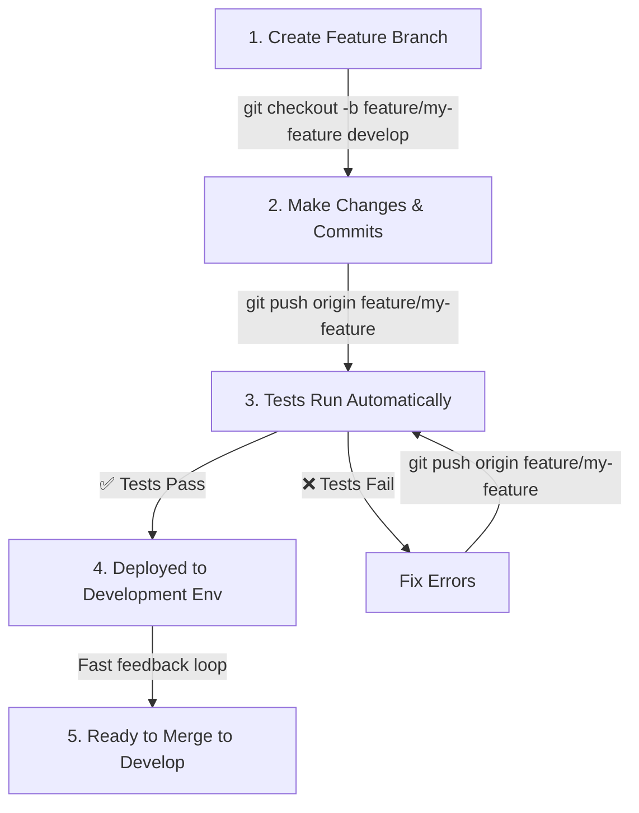
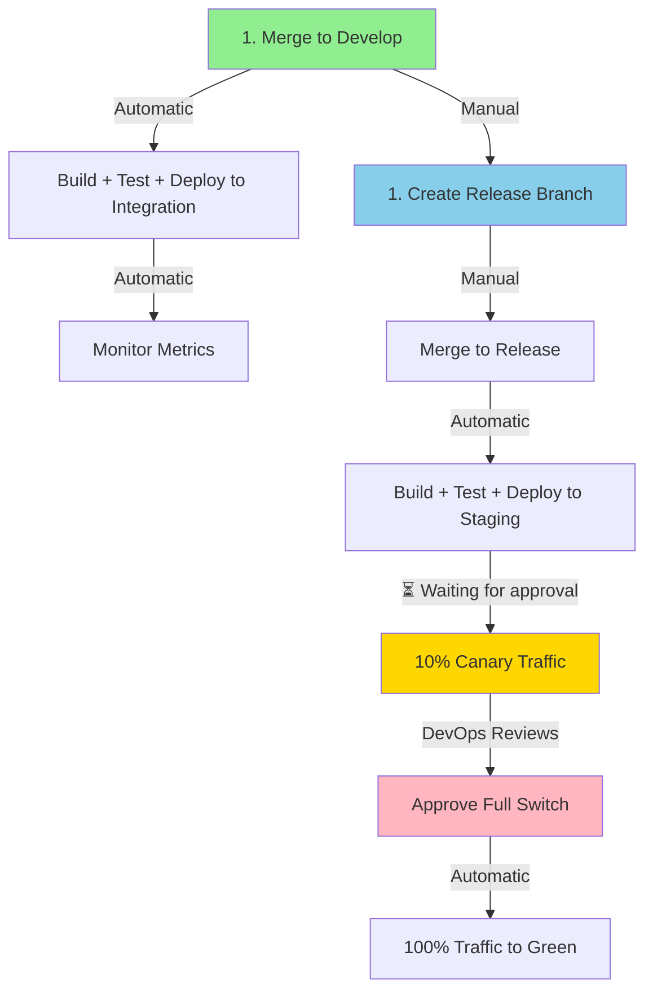
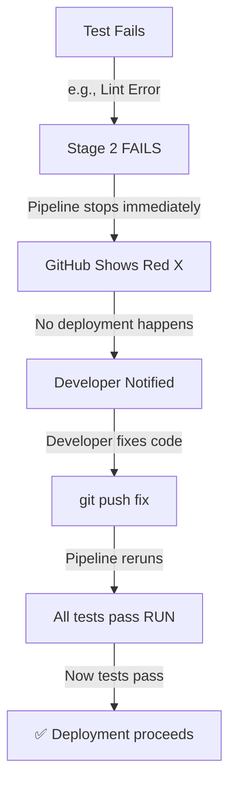

# Complete Workflow Training Guide

## For Developers, DevOps, and Release Managers

---

## Quick Start: Developer Perspective

### I'm a Developer. What's the Flow?



**You do:**
1. Create feature branch from `develop`
2. Make commits
3. Push to GitHub
4. Tests run automatically  ← *Wait here, check results*
5. If tests pass → Your code deploys to **Development** environment automatically
6. If tests fail → Fix the code, push again

**Automatic actions:**
- ✅ Build your code
- ✅ Run tests (lint, unit tests, build check, Docker build)
- ✅ Deploy to dev servers
- ✅ Run smoke tests

**Your action:**
- 🧪 Check if tests passed in GitHub Actions

---

## Quick Start: DevOps Perspective

### I'm DevOps. What Do I Monitor?



**You monitor:**
1. **Development & Integration**: Auto-deploy, verify they succeed
2. **Staging & Production**: 
   - After canary starts (10% traffic)
   - Check error rates, response times, logs
   - Approve full switch (or reject for rollback)

**Your tools:**
- GitHub Actions UI (workflow logs)
- Grafana (metrics during canary)
- Loki (logs during canary)
- Cloudflare dashboard (traffic distribution)

---

## Complete End-to-End Example

### Example: Deploying a New Feature to Production

#### Developer's Timeline:

**Monday 9am:** Feature ready
```bash
git checkout -b feature/new-player-ranking develop
# ... make changes ...
git commit -m "Add player ranking system"
git push origin feature/new-player-ranking
```

**Monday 9:05am:** Tests triggered automatically
- Build: ✅ (30 seconds)
- Lint: ✅ (20 seconds)
- Unit tests: ✅ (45 seconds)
- Docker build: ✅ (1 min)
- Summary: ✅ All tests passed

**Monday 9:10am:** Deployed to development server
- Your code running at `dev.fivem.example.com`
- Test account can verify ranking system works

**Monday 10am:** Feature branch merged to `develop`
- DevOps or tech lead merges pull request

---

#### DevOps's Timeline:

**Monday 10:05am:** Development → Integration
- Build: ✅
- Tests: ✅
- Deploy to integration (QA environment): ✅
- Smoke tests: ✅
- Status: Ready for manual testing

**Tuesday 3pm:** Feature approved, create release
```bash
# Create release branch (done by DevOps/Release Manager)
git checkout -b release/v2.5.1 develop
git push origin release/v2.5.1
```

**Tuesday 3:05pm:** Tests & Deploy to Staging
- Build: ✅
- Tests: ✅
- Deploy to GREEN servers in staging: ✅
- Run smoke tests on GREEN: ✅
- Status: Waiting for canary approval...

**Tuesday 3:15pm:** Canary Phase Starts (10% traffic)
- 10% of staging traffic → GREEN servers
- 90% of staging traffic → BLUE servers (previous version)
- DevOps monitors:
  - Error rates: ✅ Normal (0.1%)
  - Response times: ✅ Normal (45ms)
  - Logs: ✅ No exceptions
  - Duration: 30-60 seconds

**Tuesday 3:20pm:** DevOps approves full switch
- GitHub Actions: Receives approval request
- DevOps checks metrics: All good
- DevOps clicks "Approve"
- Action: 100% traffic → GREEN servers
- Status: Fully deployed to staging

**Tuesday 4pm:** Final verification before production
- Full testing on staging
- Game functionality verified
- Performance metrics verified
- Ready for production release

**Wednesday 11pm:** (Off-peak time, less user impact if issues)
- Same process for production:
  - Build: ✅
  - Tests: ✅
  - Deploy to GREEN servers (production): ✅
  - Canary: 10% traffic, metrics normal: ✅
  - DevOps approves: ✅ (after checking metrics)
  - 100% production traffic → GREEN servers
  - All users on new ranking system

**Result:** Feature went from developer's laptop → staging → production with zero downtime and automatic rollback capability at every stage.

---

## Test Gate Details

### What Tests Run?

```yaml
Test Suite (Stage 2):
├── 🔍 ESLint (JavaScript/TypeScript linting)
│   └── Catches syntax errors, code style issues
├── 🧪 Jest (Unit tests)
│   └── Tests business logic, calculations, calculations
├── 🏗️ Build Check (npm build)
│   └── Ensures code compiles/bundles correctly
├── 🐳 Docker Build
│   └── Verifies Docker image can be created
├── 📋 File Integrity Check
│   └── Critical files exist and are valid
└── 🏥 Health Check Configuration
    └── Server startup configuration verified
```

### If Tests Fail



**Example failure:**
```
❌ Jest unit tests failed

Error in src/ranking.ts:42
  expect(calculateRank(100)).toBe(5)
  ↑ Expected 5, but got 4

Fix: Add 1 to result or adjust test
```

---

## Canary Deployment Deep Dive

### What Is Canary Deployment?

Gradually roll out new version to detect problems early:

```
Timeline: 60 seconds

T+0:   GREEN deployed to servers
       [BLUE] [BLUE] [BLUE] [GREEN] [GREEN] [GREEN]
        100%   -      -      -       -       -
       (All traffic on BLUE)

T+10:  Switch 10% traffic to GREEN
       [BLUE] [BLUE] [BLUE] [GREEN] [GREEN] [GREEN]
        90%    -      -      10%     -       -
       (Traffic split: 90% BLUE, 10% GREEN)

T+40:  Monitor metrics (30 seconds)
       Error rate: 0.1% (normal)
       Response time: 45ms (normal)
       ✅ All good

T+50:  Manual approval required
       DevOps reviews metrics
       Decides: Approve or Reject

       IF APPROVED:
         T+55: Final verification
         T+60: Switch 100% traffic to GREEN
         Result: Full deployment complete

       IF REJECTED:
         T+55: Automatic rollback
         T+60: Traffic back to BLUE
         Result: Previous version restored
```

### Canary Metrics to Watch

| Metric | Good | Warning | Bad |
|--------|------|---------|-----|
| Error Rate | ≤ 0.1% | 0.1% - 1% | > 1% |
| Response Time | ≤ 50ms | 50-100ms | > 100ms |
| Database Latency | ≤ 10ms | 10-20ms | > 20ms |
| CPU Usage | ≤ 60% | 60-80% | > 80% |
| Memory Usage | ≤ 70% | 70-85% | > 85% |
| Player Online | Stable | ±5% | Dropping |

---

## Manual Approval Gate

### Who can approve?
- DevOps/SRE team
- Release manager
- Authorized senior developer

### What they check:
1. ✅ Canary metrics (error rate, response time)
2. ✅ Application logs (no exceptions)
3. ✅ Server resources (CPU, memory, disk)
4. ✅ Player reports (any issues from beta traffic?)
5. ✅ Compare to baseline (is it worse than previous version?)

### Approval decision tree:

```
Reviewing metrics...

├─ All metrics green? ✅
│  └─ Approve → Full switch to 100% traffic
│
├─ Minor issue, under 1%? 🟡
│  ├─ Is this expected? Yes → Approve
│  └─ Is this new? Yes → Reject & investigate
│
└─ Major issue, > 1% error rate? ❌
   └─ Reject immediately → Automatic rollback
```

### Approval takes 30-60 seconds

```
T+0:   Approval request appears in GitHub Actions
T+10:  DevOps opens GitHub workflow
T+20:  DevOps checks Grafana metrics dashboard
T+40:  DevOps checks application logs
T+50:  DevOps makes decision
T+60:  DevOps clicks Approve/Reject button
T+65:  Result is triggered (full switch or rollback)
```

---

## Rollback Process

### Automatic Rollback Scenarios

Rollback happens **automatically** if:
- ❌ Tests fail (Stage 2)
- ❌ Deployment fails (Stage 3)
- ❌ Smoke tests fail (Stage 3)
- ❌ Canary metrics show errors (Stage 4)
- ❌ Approval is rejected (Stage 5)
- ❌ Final health check fails (Stage 5)

### Rollback Timeline

```
T+0:   Issue detected or rejection happens
T+5:   Rollback job triggered
T+10:  Cloudflare switches traffic back to BLUE
T+20:  Verify all traffic on BLUE
T+30:  Rollback complete, users back on previous version

Total time: ~30 seconds
User impact: 0-10 seconds (minimal/none)
```

### Manual Rollback (if needed)

If automatic rollback fails for some reason:

```bash
# SSH to load balancer or Cloudflare dashboard
# Switch pool back to BLUE manually
bash deploy/switch-pool.sh <LB_ID> <BLUE_POOL_ID>
```

---

## Environment-Specific Behavior

### Development (feature/* branches)
```
Push to feature/...
    ↓
✅ Auto-build + test + deploy to DEV
    ↓
No canary (auto 100% switch)
    ↓
No approval needed
    ↓
Live immediately on DEV environment
```

### Integration (develop branch)
```
Merge to develop
    ↓
✅ Auto-build + test + deploy to INT
    ↓
No canary (auto 100% switch)
    ↓
No approval needed
    ↓
Live immediately on INT environment
```

### Staging (release/* branches)
```
Merge to release/v*.*.*
    ↓
✅ Auto-build + test + deploy to STAGING
    ↓
🟡 Canary: 10% traffic (30 seconds)
    ↓
⏳ Waiting for approval (DevOps reviews metrics)
    ↓
✅ Approved → 100% switch
❌ Rejected → Automatic rollback
```

### Production (main branch)
```
Merge to main
    ↓
✅ Auto-build + test + deploy to PROD
    ↓
🟡 Canary: 10% traffic (30 seconds)
    ↓
⏳ Waiting for approval (DevOps reviews metrics)
    ↓
✅ Approved → 100% switch
❌ Rejected → Automatic rollback
```

---

## Troubleshooting Checklist

| Issue | Check | Solution |
|-------|-------|----------|
| Tests failing | Did code build locally? | `npm run lint && npm test` |
| Tests timing out | Is test file too large? | Split into multiple test files |
| Deployment stalled at Stage 5 | Is approval timeout reached? | Approve quickly or cancel to retry |
| Canary metrics unclear | Can you access Grafana? | Check firewall, alert DevOps |
| Rollback didn't work | Did traffic stay on GREEN? | Manual switch: `bash deploy/switch-pool.sh` |
| Can't see approval button | Do you have authorization? | Ask repo admin for "Deployment Review" role |

---

## Key Takeaways

✅ **Developers:**
- Push to feature branches
- Tests run automatically
- Feedback within 5 minutes
- Focus on code quality

✅ **DevOps/Release:**
- Monitor automated processes
- Review metrics during canary
- Approve/reject at approval gate
- Handle issues and rollbacks

✅ **Everyone:**
- Zero-downtime deployments (blue/green)
- Automatic safety gates (tests)
- Gradual rollout (canary, 10% first)
- One-click rollback anytime

---

## Additional Resources

- 📊 [Pipeline Visualization](PIPELINE_VISUALIZATION.md) — Architecture diagrams
- 👤 [Approval Gate Guide](APPROVAL_GATE_GUIDE.md) — How to approve deployments
- 📋 [Deployment Checklist](DEPLOYMENT_CHECKLIST.md) — Setup & implementation steps
- 🚀 [Setup Guide](SETUP_GUIDE.md) — Initial infrastructure setup
- 🔐 [Secrets Setup](SECRETS_SETUP.md) — GitHub Secrets configuration
